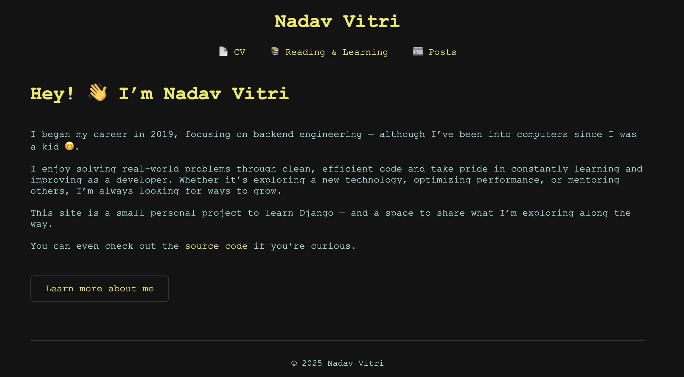

# 🧑‍💻 Nadav Vitri — Personal Website

## 📝 Introduction

This personal website is a small project I built to practice my skills with Django and Python — for fun, learning, and as a place to share my journey and things I enjoy.



---

## 🏗️ Project Structure

Here’s a simplified structure of the project:

```text
my_site/
├── core/
├── posts/
├── templates/
├── static/
├── manage.py
```

### 📦 Apps

- **core** – Handles static pages like the homepage, CV, and reading list.
- **posts** – Manages blog posts created by me via the Django admin panel.

---

## ✍️ Posts and Content

Posts are powered by two models:

- `Post`
  - Contains `title`, `content` (in Markdown), `slug` (optional, can be genereated from title), `created_at`, `updated_at` and `is_published`.
  - Markdown content is rendered in the template for easy formatting.
- `Attachment`
  - Linked to posts to store optional files (one post to many attachments)

All posts are created through the Django admin panel for simplicity.

---

## 📂 License

MIT — feel free to fork and build your own
